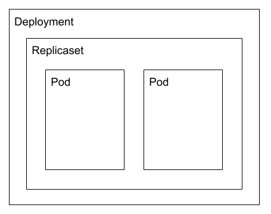
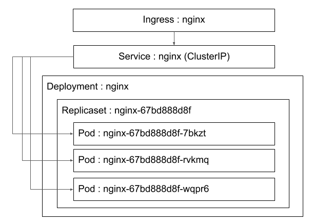

[TOC]

---

# はじめに

このチュートリアルのゴールはkubernetesの各種機能をつかって、Wordpressをkubernetesクラスター上で起動し外部からアクセス可能にすることである。 

利用する各種ファイルは[ここ](https://github.com/masanara/k8s-tutorial)。以下、説明中の各種コマンドはこのリポジトリディレクトリ内から実行することを想定している。

OpenShiftではIngressリソースの代わりに、Routerリソースが利用されるため注意が必要。


---

# 環境の準備 (ubuntuの場合)

## minikube CLIのダウンロード

[minikube](https://github.com/kubernetes/minikube)はkubernetresクラスターをmacOS/Linux/Windows上で簡単に起動するための環境。テストやPOC向けに利用することが可能。

```bash
# curl -Lo minikube https://storage.googleapis.com/minikube/releases/v0.35.0/minikube-linux-amd64 && chmod +x minikube && sudo cp minikube /usr/local/bin/ && rm minikube

# minikube version
minikube version: v0.35.0
```

## kubectlのインストール

kubernetesクラスターを管理するためのkubectlをインストールする。

```bash
sudo apt-get update && sudo apt-get install -y apt-transport-https
curl -s https://packages.cloud.google.com/apt/doc/apt-key.gpg | sudo apt-key add -
sudo sh -c 'cat <<EOF >/etc/apt/sources.list.d/kubernetes.list
deb http://apt.kubernetes.io/ kubernetes-xenial main
EOF'
apt-get update && apt-get install -y kubectl
```

## docker cliのインストール

dockerのクライアントCLIをインストールする。docker daemonはminikube VM内で起動するdockerを利用するためインストール不要。

```bash
apt-get update && apt-get install apt-transport-https ca-certificates curl gnupg-agent software-properties-common
curl -fsSL https://download.docker.com/linux/ubuntu/gpg | sudo apt-key add -
add-apt-repository \
   "deb [arch=amd64] https://download.docker.com/linux/ubuntu \
   $(lsb_release -cs) \
   stable"
apt-get update && apt-get install docker-ce-cli
```

## VirtualBoxのインストール

minikubeをVMとして起動するためのVirtualBoxをインストールする。

```bash
apt-get install virtualbox
```

## minikubeの起動

VMをスタートしてkubernetes環境が構築される。

```bash
minikube start --memory 4096 --cpus 8
```

## minikubeのIPアドレス確認

minikube VMに割り当てられているIPアドレスを確認する。

```bash
minikube ip
192.168.99.100
```

## Addonの有効化

Ingress, storage-provisionor, storage-provisioner-glusterを有効化する

```bash
minikube addons enable ingress
-   ingress was successfully enabled

minikube addons enable storage-provisioner
-   storage-provisioner was successfully enabled

minikube addons enable storage-provisioner-gluster
-   storage-provisioner-gluster was successfully enabled

minikube config view
- ingress: true
- storage-provisioner: true
- storage-provisioner-gluster: true
```

> 一度有効化したminikubeのaddonを、無効化して再度有効化した場合、pvが作成できない場合がある。作成できなくなった場合は、```minikube delete```で一度環境を削除して再度```minikube start```すると正常に機能する>場合がある。

## Docker環境変数の設定

VM内で起動するdockerをホストから利用できるよう環境変数を設定する。

```bash
minikube docker-env > ~/.bashrc
source ~/.bashrc

env | grep DOCKER
DOCKER_TLS_VERIFY="1"
DOCKER_HOST="tcp://192.168.99.100:2376"
DOCKER_CERT_PATH="/Users/masanara/.minikube/certs"
DOCKER_API_VERSION="1.35"
```

VM内のdockerデーモンに接続可能なことを確認する

```bash
docker version
Client: Docker Engine - Community
 Version:           18.09.3
 API version:       1.35
 Go version:        go1.10.8
 Git commit:        774a1f4
 Built:             Thu Feb 29 06:40:58 2019
 OS/Arch:           linux/amd64
 Experimental:      false

Server:
 Engine:
  Version:          18.06.2-ce
  API version:      1.38 (minimum version 1.12)
  Go version:       go1.10.3
  Git commit:       6d37f41
  Built:            Sun Feb 10 03:51:58 2019
  OS/Arch:          linux/amd64
  Experimental:     false
```


---

# コンテナイメージの作成

コンテナイメージはDockerfileを設計書として、```docker build```コマンドにより作成することが可能。

## 作成準備

### Dockerfileの作成

- ```FROM alpine:3.29```とすることで、alpine linuxのバージョン3.9をベースとしたイメージを作成する。
- ```RUN```によりコンテ内で実行するコマンドを指定する。
- ```COPY```によりファイルをコンテナ内にコピーする。
- ```CMD```によりコンテナが起動した際に実行されるコマンドを指定する。

Dockerfileで利用可能なオプションの詳細は[ここ](https://docs.docker.com/engine/reference/builder/)を参照。

```dockerfile
FROM alpine:3.9
RUN apk --update add nginx && mkdir /var/www/html
COPY nginx.conf /etc/nginx/nginx.conf
COPY index.html /var/www/html/index.html
EXPOSE 80
CMD ["nginx","-g","daemon off; pid /run/nginx.pid;"]
```

上記Dockerfileにより以下のようなイメージが作成される。各行がコンテナイメージのレイヤーとして作成される。


### nginx.confの設定例

コンテナ内にコピーするnginxの設定ファイルを用意する。設定ファイルのポイントは以下の2点。

- エラーログ、アクセスログをそれぞれ標準エラー出力(/dev/stderr)、標準出力(/dev/stdout)に出力するよう指定。
- /var/www/htmlディレクトリ内のindex.htmlをディレクトリインデックスとして指定。

```
user nginx;
worker_processes auto;
pcre_jit on;
error_log /dev/stderr warn;
include /etc/nginx/modules/*.conf;
events {
	worker_connections 1024;
}
http {
	include /etc/nginx/mime.types;
	default_type application/octet-stream;
	server_tokens off;
	client_max_body_size 1m;
	keepalive_timeout 65;
	sendfile on;
	tcp_nodelay on;
	ssl_prefer_server_ciphers on;
	ssl_session_cache shared:SSL:2m;
	gzip_vary on;
	log_format main '$remote_addr - $remote_user [$time_local] "$request" '
			'$status $body_bytes_sent "$http_referer" '
			'"$http_user_agent" "$http_x_forwarded_for"';
	access_log /dev/stdout main;
  server {
    listen 80 default_server;
    server_name _;
    sendfile off;
    root /var/www/html;
    index index.html;
    location / {
      try_files $uri $uri /index.html;
     }
  }
}
```

### index.htmlの例

nginxコンテナがWebサーバーとして提供するコンテンツとして、任意のhtmlファイルを作成。

```html
<html><body><h1>Docker TEST</h1></body></html>
```

## docker buildコマンドによるイメージの作成

Dockerfile, nginx.conf, index.htmlを同じディレクトリに置き、該当のディレクトリ内で```docker build```コマンドを実行する。```-t```オプションでタグ名(イメージ名)を指定する。

```shell
docker build -t nginx:alpine .
```

## コンテナの実行

### docker runコマンドによるコンテナの起動

```docker run```コマンドによりコンテナイメージをしてコンテナの起動が可能。```-p```オプションによりコンテナ実行ホストのポートにコンテナのポートをマッピングして、外部公開可能。

```shell
docker run -d -p 8080:80 nginx:alpine
```

### docker psコマンドによるコンテナの起動確認

起動しているコンテナは```docker ps```コマンドにより確認可能。

```shell
docker ps

CONTAINER ID        IMAGE               COMMAND                  CREATED             STATUS              PORTS                  NAMES
bb6f01dba077        nginx:alpine        "nginx -g 'daemon of…"   7 seconds ago       Up 6 seconds        0.0.0.0:8080->80/tcp   relaxed_austin
```

### curlコマンドによりコンテナの起動を確認

curlコマンドによりlocalhostの8080番ポートに接続し、nginxが起動していることを確認する。

```shell
curl localhost:8080

<html><body><h1>Docker TEST</h1></body></html>
```

## (オプション) docker hubへのコンテナイメージの登録

### docker loginによりDocker Hubにログイン

作成したコンテナイメージはDocker HubなどのRegistryに登録可能。Docker Hubにコンテナイメージを登録する場合はアカウントの作成が必要。([https://hub.docker.com/signup](https://hub.docker.com/signup)からアカウントの作成が必要。)

Docker Hubの他に、パブリッククラウドの提供する、Amazon ECR(*aws_account_id*.dkr.ecr.*region*.amazonaws.com)、Google Container Registry(GCR:gcr.io)、Azure Container Registory(ACR:azurecr.io)が利用可能。オンプレミスにRegistryを構築することでプライベートなレジストリを利用することも可能。

```shell
docker login

Login with your Docker ID to push and pull images from Docker Hub. If you don't have a Docker ID, head over to https://hub.docker.com to create one.
Username: username000
Password: xxxxxxxx
Login Succeeded
```

### コンテナイメージのタグ付

docker hubにアップロードするために、コンテナイメージに新たなタグ付けをする。タグ名は[自身のDocker Hubのアカウント名]/nginx:alpineとすること。

```shell
docker tag nginx:alpine username000/nginx:alpine
```

### タグ付けされたコンテナイメージの確認

````shell
docker images

REPOSITORY                     TAG                 IMAGE ID            CREATED             SIZE
nginx                          alpine              2e8ce637cbae        21 minutes ago      8.27MB
username000/nginx              alpine              2e8ce637cbae        21 minutes ago      8.27MB
````

### コンテナイメージのプッシュ

```shell
docker push username000/nginx:alpine

The push refers to repository [docker.io/username000/nginx]
41c468a6a8fc: Pushed
36f565774019: Pushed
e1465c7bf8f8: Layer already exists
503e53e365f3: Layer already exists
alpine: digest: sha256:5bb7690c75f1b6fb217b951fc5152df9b77f9a74e92450f19d8226f382175684 size: 1154
```


---

# kubectlコマンドの基本

## クラスターへの接続

kuberneteseクラスターの操作はkubectlコマンドにより実行する。kubectlコマンドはkubernetesクラスターのMasterに接続してリモートで操作を行うことが可能。


### kubectlの設定ファイル

```~/.kube/config```ファイルに接続先のkubernetes cluster情報や、接続に必要な認証情報が保存されている。接続に関する情報はcontextと呼ばれるオブジェクトで管理され、接続先・認証方法の組み合わせをパラメータとして持つ。複数のcontextをconfig内に定義可能。通常設定ファイルを記述する必要はなく、何らかの方法でconfigファイルが提供される。

```yaml
apiVersion: v1
clusters:
- cluster:
    insecure-skip-tls-verify: true
    server: https://k8s-master1.example.com:8443
  name: k8s-master1-example-com:8443
- cluster:
    insecure-skip-tls-verify: true
    server: https://k8s-master2.example.com:8443
  name: k8s-master2-example-com:8443
contexts:
- context:
    cluster: k8s-master1-example-com:8443
    namespace: "my-namespace"
    user: user01/k8s-master1-example-com:8443
  name: my-namespace on master1
- context:
    cluster: k8s-master2-example-com:8443
    namespace: "ns1"
    user: user02/k8s-master2-example-com:8443
  name: ns1 on master2
current-context: ns1 on master2
kind: Config
preferences: {}
users:
- name: user01/k8s-master1-example-com:8443
  user:
    token: XXXXXXXXX
- name: user02/k8s-master2-example-com:8443
  user:
    token: XXXXXXXXX
```

### Contextの確認

接続先やnamespaceはContextとして定義されている。

```shell
kubectl config get-contexts
CURRENT   NAME                      CLUSTER                        AUTHINFO                              NAMESPACE
          my-namespace on master1   k8s-master1-example-com:8443   user01/k8s-master1-example-com:8443   my-namespace
*         ns1 on master2            k8s-master2-example-com:8443   user02/k8s-master2-example-com:8443   ns1
```

### Contextの切り替え

contextを切り替えることで、kubectlの接続先を変更することが可能。

```shell
kubectl config use-context 'my-namespace on master1'
Switched to context "my-namespace on master1".

kubectl config get-contexts
CURRENT   NAME                      CLUSTER                        AUTHINFO                              NAMESPACE
*         my-namespace on master1   k8s-master1-example-com:8443   user01/k8s-master1-example-com:8443   my-namespace
          ns1 on master2            k8s-master2-example-com:8443   user02/k8s-master2-example-com:8443   ns1
```

## クラスター上のリソースの確認

```kubectl get 〜```で各種リソースの存在を確認可能。

### kubernetes nodeの確認

```shell
kubectl get nodes
NAME          STATUS   ROLES    AGE   VERSION
k8s-node-01   Ready    <none>   26d   v1.12.4
k8s-node-02   Ready    <none>   27d   v1.12.4
k8s-node-03   Ready    <none>   27d   v1.12.4
k8s-node-04   Ready    <none>   26d   v1.12.4
k8s-node-05   Ready    <none>   27d   v1.12.4
k8s-node-06   Ready    <none>   27d   v1.12.4
k8s-node-07   Ready    <none>   26d   v1.12.4
k8s-node-08   Ready    <none>   27d   v1.12.4
```

```-w o```オプションを利用すると詳細情報を確認可能

```shell
kubectl get nodes -o wide
NAME          STATUS   ROLES    AGE   VERSION   INTERNAL-IP   EXTERNAL-IP   OS-IMAGE             KERNEL-VERSION      CONTAINER-RUNTIME
k8s-node-01   Ready    <none>   26d   v1.12.4   172.10.0.12   172.10.0.12   Ubuntu 16.04.5 LTS   4.15.0-43-generic   docker://18.6.1
k8s-node-02   Ready    <none>   27d   v1.12.4   172.10.0.5    172.10.0.5    Ubuntu 16.04.5 LTS   4.15.0-43-generic   docker://18.6.1
k8s-node-03   Ready    <none>   27d   v1.12.4   172.10.0.10   172.10.0.10   Ubuntu 16.04.5 LTS   4.15.0-43-generic   docker://18.6.1
k8s-node-04   Ready    <none>   26d   v1.12.4   172.10.0.11   172.10.0.11   Ubuntu 16.04.5 LTS   4.15.0-43-generic   docker://18.6.1
k8s-node-05   Ready    <none>   27d   v1.12.4   172.10.0.9    172.10.0.9    Ubuntu 16.04.5 LTS   4.15.0-43-generic   docker://18.6.1
k8s-node-06   Ready    <none>   27d   v1.12.4   172.10.0.7    172.10.0.7    Ubuntu 16.04.5 LTS   4.15.0-43-generic   docker://18.6.1
k8s-node-07   Ready    <none>   26d   v1.12.4   172.10.0.6    172.10.0.6    Ubuntu 16.04.5 LTS   4.15.0-43-generic   docker://18.6.1
k8s-node-08   Ready    <none>   27d   v1.12.4   172.10.0.8    172.10.0.8    Ubuntu 16.04.5 LTS   4.15.0-43-generic   docker://18.6.1
```

### リソース個別の確認

```kubectl get 〜```で指定した各リソースの個別の情報を表示可能。

```shell
kubectl get node k8s-node-01
NAME          STATUS   ROLES    AGE   VERSION
k8s-node-01   Ready    <none>   26d   v1.12.4
```

```-o json```オプションによりJSONフォーマットですべての情報を出力可能。(yamlオプションも利用可能)

```json
kubectl get node k8s-node-01 -o json

{
    "apiVersion": "v1",
    "kind": "Node",
    "metadata": {
        "annotations": {
            "node.alpha.kubernetes.io/ttl": "0",
            "volumes.kubernetes.io/controller-managed-attach-detach": "true"
        },
        "creationTimestamp": "2019-01-17T02:51:43Z",
...
```

```kubectl describe 〜```で指定した各リソースの詳細を確認可能。以下はnodeの表示例。PodやDeployment、Serviceなども確認可能。

```shell
kubectl describe node k8s-node-01
Name:               k8s-node-01
Roles:              <none>
Labels:             beta.kubernetes.io/arch=amd64
                    beta.kubernetes.io/os=linux
                    bosh.id=df99fcd8-0438-497e-be72-5fa57be5d67d
                    bosh.zone=Compute-AZ
                    failure-domain.beta.kubernetes.io/zone=Compute-AZ
                    kubernetes.io/hostname=172.10.0.12
                    spec.ip=172.10.0.12
Annotations:        node.alpha.kubernetes.io/ttl: 0
                    volumes.kubernetes.io/controller-managed-attach-detach: true
CreationTimestamp:  Thu, 17 Jan 2019 11:51:43 +0900
....
```


---

# kubernetes上でのコンテナの実行

## CLIによるDeploymentの作成

### deploymentの確認

なにも作成されていないことを確認する。

```shell
kubectl get deployment
```

### kubectl runコマンドによるdeploymentの作成

```kubectl run```コマンドにコンテナイメージ(```--image=nginx:alpine```)、アプリ名(```nginx```)、アプリのポート番号(```--port=80```)を指定して実行することで、コンテナイメージがPodとして起動する。

```shell
kubectl run nginx --image=nginx:alpine --port=80
```

```kubectl run```によるdeploymentの作成は推奨されていない。

> kubectl run --generator=deployment/apps.v1 is DEPRECATED and will be removed in a future version. Use kubectl run --generator=run-pod/v1 or kubectl create instead.

### 作成されたリソースの確認

deployment, replicaset, podが作成されている

```shell
kubectl get all
NAME                         READY     STATUS    RESTARTS   AGE
pod/nginx-65748db69b-69xct   1/1       Running   0          29s

NAME                 TYPE        CLUSTER-IP   EXTERNAL-IP   PORT(S)   AGE
service/kubernetes   ClusterIP   10.96.0.1    <none>        443/TCP   5d

NAME                    DESIRED   CURRENT   UP-TO-DATE   AVAILABLE   AGE
deployment.apps/nginx   1         1         1            1           29s

NAME                               DESIRED   CURRENT   READY     AGE
replicaset.apps/nginx-65748db69b   1         1         1         29s
```

DeploymentとReplicaset、Podは以下のような関係になっており、Deploymentを作成したことによりReplicaset/Podが作成されている。



## ServiceによるPodの外部公開

### kubectl exposeによりdeploymentをNodePort Serviceとして公開

NodePort ServiceはKubernetes Nodeのポート番号を利用して、Podへのアクセスを行うためのServiceリソース。Serviceには以下の種類がある。

- ClusterIp : クラスタ内のIPにServiceを公開する。Serviceはクラスタ内からのみアクセス可能。(デフォルトのServiceType)

- NodePort : 各ノードのIP上のServiceを静的ポート(NordPort)に公開する。NodePort ServiceがルーティングするClusterIP Serviceが自動的に作成される。```<NodeIp>:<NordPort>```を要求することで、クラスタ外からNordPort Serviceにアクセス可能。利用可能なポート番号は30000～32767の範囲に限定される。
- LoadBalancer : クラウドプロバイダのロードバランサを使用して外部にServiceを公開する。外部ロードバランサがルーティングするNordPort ServiceとClusterIP Serviceが自動的に作成される。
- ExternalName : 値を含むCNAMEレコードを返すことにより、ServiceをexternalNameフィールドのコンテンツ(たとえば、foo.bar.example.com)にマッピングする。(この型を使うにはバージョン1.7以上のkube-dnsが必要)

```shell
kubectl expose deployment nginx --name=nginx-np --port=80 --target-port=80 --type="NodePort"
```

### Serviceの確認

Serviceリソースを確認すると、nginx-npサービスが作成され割り当てられたNodePort(以下の例では32726番)を確認可能。

```shell
kubectl get svc
NAME         TYPE        CLUSTER-IP      EXTERNAL-IP   PORT(S)        AGE
kubernetes   ClusterIP   10.96.0.1       <none>        443/TCP        5d
nginx-np     NodePort    10.108.151.22   <none>        80:32726/TCP   32s
```

### Serviceへのアクセス確認

NodeのIPアドレスにポート番号をつけてアクセスする。(NodeのIPアドレスは```kubectl get node -o wide```により確認可能。)

```shell
curl 192.168.99.100:32726
<html><body><h1>Docker TEST</h1></body></html>
```

## Podのスケールアウト

deploymentのレプリカ数を3に変更し、ReplicasetのDESIRED数が変更されることを確認。Pod数も指定した数に変更される。

### Replicaset状態の確認

スケールアウト前にReplicasetの状態を確認し、```DESIRED=1```となっていることを確認する。

```shell
kubectl get rs
NAME               DESIRED   CURRENT   READY     AGE
nginx-65748db69b   1         1         1         54s
```

### Replica数の変更

DeploymentのReplica数を3に変更する

```shell
kubectl scale  --replicas=3 deployment/nginx
deployment.extensions "nginx" scaled
```

### ReplicasetとPod数の確認

Replicasetがのレプリカ数が3に変更され、Pod数が3つに増えたことを確認する

```shell
kubectl get rs
NAME               DESIRED   CURRENT   READY     AGE
nginx-65748db69b   3         3         2         1m

kubectl get pods
NAME                     READY     STATUS    RESTARTS   AGE
nginx-65748db69b-bhcxv   1/1       Running   0          1m
nginx-65748db69b-lzpwj   1/1       Running   0          11s
nginx-65748db69b-xpms4   1/1       Running   0          11s
```


---

# Ingressによるサービスの公開

通常、ClusterIPやNodeIPでPodを外部公開することはしない。Ingressと呼ばれるリソースによりClusterIPを外部に対してL7 Load Balancerで公開する。

## ClusterIP Serviceの作成

Nginx deploymentに対するClusterIP Serviceを新たに作成する。

```shell
kubectl expose deploy nginx --port=80 --target-port=80
service "nginx" exposed
```

作成されたClusterIP Serviceを確認する。

```shell
kubectl get svc
NAME         TYPE        CLUSTER-IP      EXTERNAL-IP   PORT(S)        AGE
kubernetes   ClusterIP   10.96.0.1       <none>        443/TCP        5d
nginx        ClusterIP   10.109.15.84    <none>        80/TCP         38m
nginx-np     NodePort    10.108.151.22   <none>        80:32726/TCP   48m
```

## Ingressリソースの作成

> IngressのFQDN(.spec.rules[].host)は環境似合わせて適切なFQDNに変更すること。

```yaml
apiVersion: extensions/v1beta1
kind: Ingress
metadata:
  name: nginx
spec:
  rules:
  - host: nginx.minikube.example
    http:
      paths:
      - backend:
          serviceName: nginx
          servicePort: 80
```

上記yamlによりIngressリソースを作成する。

```shell
kubectl apply -f nginx/ingress.yaml
ingress.extensions "nginx" created
```

作成したIngressを確認する。

```shell
kubectl get ingress
NAME      HOSTS                ADDRESS   PORTS     AGE
nginx     nginx.minikube.example             80        15s
```

## Ingressへのアクセス確認

作成したIngressにアクセスするには指定したFQDNに対する名前解決(hostsファイル or DNS)を設定するか、アクセス時にHostヘッダを付与する。

```shell
curl 192.168.99.100 -H 'Host: nginx.minikube.example'
<html><body><h1>Docker TEST</h1></body></html
```

## 作成したリソースの削除

ここまでで作成したIngress, Deployment, Serviceリソースをすべて削除。 

```shell
kubectl delete -f nginx/ingress.yaml
ingress.extensions "nginx" deleted

kubectl delete deploy nginx
deployment.extensions "nginx" deleted

kubectl delete svc nginx
service "nginx" deleted

kubectl delete svc nginx-np
service "nginx-np" deleted
```


---

# 運用に利用するコマンド

## コンテナ内のlog確認

コンテナのログ・エラーを適切に設定しておくと、```kubectl logs```コマンドによりログを確認可能。podの状態の一覧を確認し、PodのIDを指定してPodの標準出力に対するログ出力を確認

```shell
kubectl get pods
kubNAME                     READY     STATUS    RESTARTS   AGE
nginx-65748db69b-bhcxv   1/1       Running   0          6m
nginx-65748db69b-lzpwj   1/1       Running   0          5m
nginx-65748db69b-xpms4   1/1       Running   0          5m

kubectl logs -f nginx-65748db69b-bhcxv
172.17.0.1 - - [12/Feb/2019:15:20:19 +0000] "GET / HTTP/1.1" 200 47 "-" "curl/7.52.1" "-"
172.17.0.1 - - [12/Feb/2019:15:20:20 +0000] "GET / HTTP/1.1" 200 47 "-" "curl/7.52.1" "-"
```

## コンテナ内のシェル実行

コンテナを指定して、```kubectl exec```コマンドによりコンテナ内のシェルを実行可能。(通常コンテナにSSHすることはせず、```kubectl exec```を利用する)

```shell
kubectl get pods
kNAME                     READY     STATUS    RESTARTS   AGE
nginx-65748db69b-bhcxv   1/1       Running   0          7m
nginx-65748db69b-lzpwj   1/1       Running   0          6m
nginx-65748db69b-xpms4   1/1       Running   0          6m

kubectl exec -it nginx-65748db69b-bhcxv /bin/sh
/ # ls -l /etc/nginx/
total 36
drwxr-xr-x    2 root     root          4096 Feb 12 08:47 conf.d
-rw-r--r--    1 root     root          1077 Dec 18 20:20 fastcgi.conf
-rw-r--r--    1 root     root          1007 Dec 18 20:20 fastcgi_params
-rw-r--r--    1 root     root          5170 Dec 18 20:20 mime.types
drwxr-xr-x    2 root     root          4096 Feb 12 08:47 modules
-rw-r--r--    1 root     root          2908 Feb 12 09:17 nginx.conf
-rw-r--r--    1 root     root           636 Dec 18 20:20 scgi_params
-rw-r--r--    1 root     root           664 Dec 18 20:20 uwsgi_params
```

## リソース詳細の確認

kubernetesの各種リソースの詳細を確認するには、```kubectl describe```コマンドを利用する。Podの作成が失敗した場合はこのコマンドで原因調査が可能。

```bash
kubectl get pods
NAME                     READY   STATUS         RESTARTS   AGE
mysql-7f96fb5df6-b2sh7   0/1     Pending        0          22m
nginx-84474f874-5fsvf    0/1     ErrImagePull   0          13s
nginx-84474f874-c7s9v    0/1     ErrImagePull   0          13s
nginx-84474f874-sjpkd    0/1     ErrImagePull   0          13s

kubectl describe pod nginx-84474f874-5fsvf
Name:               nginx-84474f874-5fsvf
Namespace:          default
...
Events:
  Type     Reason     Age   From               Message
  ----     ------     ----  ----               -------
  Normal   Scheduled  20s   default-scheduler  Successfully assigned default/nginx-84474f874-5fsvf to minikube
  Normal   Pulling    18s   kubelet, minikube  pulling image "masanara/nginx-php:0.8"
  Warning  Failed     12s   kubelet, minikube  Failed to pull image "masanara/nginx-php:0.8": rpc error: code = Unknown desc = Error response from daemon: manifest for masanara/nginx-php:0.8 not found
  Warning  Failed     12s   kubelet, minikube  Error: ErrImagePull
  Normal   BackOff    12s   kubelet, minikube  Back-off pulling image "masanara/nginx-php:0.8"
  Warning  Failed     12s   kubelet, minikube  Error: ImagePullBackOff
```


---

# YAMLファイルによるリソースの作成

これまではkubectlコマンドを利用して、Deployment/Pod/Service/Ingress(リソース)を作成してきたが通常はYAMLファイルで定義し、YAMLファイルによりkubernetesクラスター上にリソースを作成する。

- Deploymentを定義
  - コンテナイメージの指定(masanara/nginx-php:1.0)
  - レプリカ数を3に指定
  - コンテナに対するprobe(ヘルスチェック)の指定
- Serviceを定義
  - ClusterIPとしてサービスを定義
- Ingressを定義
  - Ingressとして「nginx.minikube.example」に対するアクセスを定義
  - nginx serviceに対してIngressを定義

## リソースの定義方法

上記のDeployment, Service, Ingressを一つのYAMLファイルにした例は以下の通り。複数のyamlファイルは```---```で区切ることで、単一のyamlファイルとすることができるため、Deployment、Serviceを単一のファイルとして作成。

```yaml
apiVersion: extensions/v1beta1
kind: Deployment
metadata:
  name: nginx
spec:
  replicas: 3
  selector:
    matchLabels:
      app: nginx
  strategy:
    rollingUpdate:
      maxSurge: 1
      maxUnavailable: 0
    type: RollingUpdate
  template:
    metadata:
      labels:
        app: nginx
    spec:
      containers:
      - image: masanara/nginx-php:1.0
        imagePullPolicy: IfNotPresent
        name: nginx
        ports:
        - containerPort: 80
          protocol: TCP
        readinessProbe:
          failureThreshold: 3
          httpGet:
            path: /index.php
            port: 80
            scheme: HTTP
          initialDelaySeconds: 15
          periodSeconds: 5
          successThreshold: 1
          timeoutSeconds: 1
---
apiVersion: v1
kind: Service
metadata:
  name: nginx
spec:
  ports:
  - port: 80
    protocol: TCP
  selector:
    app: nginx
```

## YAMLファイルによるリソースの作成

YAMLファイルによりリソースを作成する場合は、```kubectl apply -f filename```を利用する。

```bash
kubectl apply -f nginx/nginx.yaml
deployment.extensions/nginx created
service/nginx created

kubectl apply -f nginx/ingress.yaml
ingress.extensions/nginx created
```

## 作成されたリソースの確認

作成されたリソースは```kubectl get```により確認可能。```get all```によりリソース名を個別に指定することなくリソースを表示することが可能。一部のリソースは表示されないので注意。(configmapやpv等)

```shell
kubectl get all

NAME                         READY     STATUS    RESTARTS   AGE
pod/nginx-67bd888d8f-7bkzt   1/1       Running   0          6m
pod/nginx-67bd888d8f-rvkmq   1/1       Running   0          6m
pod/nginx-67bd888d8f-wgpr6   1/1       Running   0          6m

NAME                 TYPE        CLUSTER-IP       EXTERNAL-IP   PORT(S)   AGE
service/kubernetes   ClusterIP   10.96.0.1        <none>        443/TCP   5d
service/nginx        ClusterIP   10.109.235.186   <none>        80/TCP    6m

NAME                    DESIRED   CURRENT   UP-TO-DATE   AVAILABLE   AGE
deployment.apps/nginx   3         3         3            3           6m

NAME                               DESIRED   CURRENT   READY     AGE
replicaset.apps/nginx-67bd888d8f   3         3         3         6m

kubectl get ingress
NAME      HOSTS                ADDRESS     PORTS     AGE
nginx     nginx.minikube.example   10.0.2.15   80        4m
```

上記リソースの構成は以下の通り。



## Ingressに対するアクセスの確認

```shell
curl nginx.minikube.example
nginx-67bd888d8f-7bkzt:172.17.0.7:version 1.0

curl nginx.minikube.example
nginx-67bd888d8f-wgpr6:172.17.0.8:version 1.0

curl nginx.minikube.example
nginx-67bd888d8f-rvkmq:172.17.0.4:version 1.0
```

## YAMLファイルによるリソースの削除

YAMLファイルにより作成したリソースは同じYAMLファイルを利用して削除可能。

```bash
kubectl delete -f nginx-sample.yaml
deployment.extensions "nginx" deleted
service "nginx" deleted
ingress.extensions "nginx" deleted
```


---

# Podの作成例

単一Podに複数コンテナを作成することができ、同一Pod内ではネットワークが共有されストレージも共有することができる。


## 複数コンテナで構成されるPodの定義方法

以下のようなPod定義ファイルにより単一Pod内で複数のContainerを実行することが可能。(サイドカーパターンと呼ばれるPodのデプロイ方法)

- shared-logsというVolumeを作成する。(emptyDirであるためPodの削除と同時にVolumeは削除される)

- alpine-linuxコンテナは5秒ごとにshred-logsボリュームのファイル(/var/log/app.txt)にタイムスタンプを追記し続ける。
- nginxコンテナはshared-logsボリュームのファイル(/usr/share/nginx/html)をHTTPサーバーのコンテンツとして公開する。

```yaml
apiVersion: v1
kind: Pod
metadata:
  name: mc-pod
  labels:
spec:
  volumes:
  - name: shared-logs
    emptyDir: {}
  containers:
  - name: alpine-linux
    image: alpine:3.9
    command: ["/bin/sh"]
    args: ["-c", "while true; do date >> /var/log/app.txt; sleep 5; done"]
    volumeMounts:
    - name: shared-logs
      mountPath: /var/log
  - name: nginx
    image: nginx:1-alpine
    volumeMounts:
    - name: shared-logs
      mountPath: /usr/share/nginx/html
```

## 複数コンテナで構成されるPodの作成

上記定義ファイルによりPodを起動してみる。podが起動し、```READY```が```2/2```と表示されている。これは2つのコンテナが定義されており、2つともコンテナが起動していることを表している。

```
kubectl apply -f pod/mc-pod.yaml
pod/mc-pod created

kubectl get pods
NAME                     READY   STATUS    RESTARTS   AGE
mc-pod                   2/2     Running   0          75s
```

```kubectl describe```コマンドで確認するとpod内に2つのコンテナが起動していることを確認できる。

```bash
kubectl describe pod mc-pod
Name:               mc-pod
Namespace:          default
Priority:           0
PriorityClassName:  <none>
...
Containers:
  alpine-linux:
    Container ID:  docker://03ecfb3b93458340a6064557d92298acb846a4b259b5b5f4c4d00c2bce10dc18
    Image:         alpine:3.9
    State:         Running
...
  nginx:
    Container ID:  docker://664f1c8d0f8b420b52b9c1e6dbd9ab29a6b487ad63003322f849b1762ad12564
    Image:         nginx:1-alpine
    State:         Running
```

## Pod内の確認

```kubectl exec```コマンドでpod内を確認してみる。

### alpine-linuxコンテナへの接続

localhost宛の接続でhttpサーバー(nginx)がコンテンツを返してくれるが、プロセスとしてはnginxは動いていない。

```bash
kubectl exec -it mc-pod -c alpine-linux /bin/sh
/ # wget localhost/app.txt
Connecting to localhost (127.0.0.1:80)
app.txt              100% |************************************************************************************************************************************|  2262  0:00:00 ETA
/ # tail app.txt
Thu Mar  7 01:28:29 UTC 2019
Thu Mar  7 01:28:34 UTC 2019
Thu Mar  7 01:28:39 UTC 2019
Thu Mar  7 01:28:44 UTC 2019
Thu Mar  7 01:28:49 UTC 2019
Thu Mar  7 01:28:54 UTC 2019
Thu Mar  7 01:28:59 UTC 2019
Thu Mar  7 01:29:04 UTC 2019
Thu Mar  7 01:29:09 UTC 2019
Thu Mar  7 01:29:14 UTC 2019
/ # ps ax
PID   USER     TIME  COMMAND
    1 root      0:00 /bin/sh -c while true; do date >> /var/log/app.txt; sleep 5; done
  161 root      0:00 /bin/sh
  222 root      0:00 sleep 5
  223 root      0:00 ps ax
/ # ip a
1: lo: <LOOPBACK,UP,LOWER_UP> mtu 65536 qdisc noqueue state UNKNOWN qlen 1000
    link/loopback 00:00:00:00:00:00 brd 00:00:00:00:00:00
    inet 127.0.0.1/8 scope host lo
       valid_lft forever preferred_lft forever
2: sit0@NONE: <NOARP> mtu 1480 qdisc noop state DOWN qlen 1000
    link/sit 0.0.0.0 brd 0.0.0.0
36: eth0@if37: <BROADCAST,MULTICAST,UP,LOWER_UP,M-DOWN> mtu 1500 qdisc noqueue state UP
    link/ether 02:42:ac:11:00:0a brd ff:ff:ff:ff:ff:ff
    inet 172.17.0.10/16 brd 172.17.255.255 scope global eth0
       valid_lft forever preferred_lft forever
/ # exit
```

### nginxコンテナへの接続

nginxコンテナではnginxが起動しており、alpine-linuxコンテナと同じIPアドレスが利用されており、ネットワークネームスペースは共有されている。

```bash
kubectl exec -it mc-pod -c nginx /bin/sh
/ # ps ax
PID   USER     TIME  COMMAND
    1 root      0:00 nginx: master process nginx -g daemon off;
    7 nginx     0:00 nginx: worker process
    8 root      0:00 /bin/sh
   14 root      0:00 ps ax
/ # ip a
1: lo: <LOOPBACK,UP,LOWER_UP> mtu 65536 qdisc noqueue state UNKNOWN qlen 1000
    link/loopback 00:00:00:00:00:00 brd 00:00:00:00:00:00
    inet 127.0.0.1/8 scope host lo
       valid_lft forever preferred_lft forever
2: sit0@NONE: <NOARP> mtu 1480 qdisc noop state DOWN qlen 1000
    link/sit 0.0.0.0 brd 0.0.0.0
36: eth0@if37: <BROADCAST,MULTICAST,UP,LOWER_UP,M-DOWN> mtu 1500 qdisc noqueue state UP
    link/ether 02:42:ac:11:00:0a brd ff:ff:ff:ff:ff:ff
    inet 172.17.0.10/16 brd 172.17.255.255 scope global eth0
       valid_lft forever preferred_lft forever
/ # exit
```

確認が終わったら、作成したPodを削除する。yamlファイル(pod/mc-pod.yaml)を利用した削除も可能。

```bash
kubectl delete pod mc-pod
```


---

# Persistent Volume

通常、Podは削除されると起動中に変更されたデータもすべて失われる。データを永続的に保存するためにPersistent Volumeが利用される。PersistentVolumeは外部の永続ボリュームを提供するシステムと連携して、新規のボリューム作成や、既存ボリュームの削除を行うことが可能。PesistentVolumeにはProvisoner(プラグイン)が用意されておりStorageClassとして定義することで、GlusterFSやvSphere Storage、AWSのEBS等を利用してPod向けのVolumeの作成や削除が可能。

Dynamic Provisioning機能により、Podから利用するための永続ボリュームをPersistentVolumeClaimとしてStorageClassに対して要求することで、Persistent Volumeが必要に応じて作成される。

## StorageClassの定義

環境によってはStorageClass(sc)が事前定義されている。

### minikubeの場合

```bash
kubectl get storageclass
NAME                    PROVISIONER                AGE
glusterfile (default)   gluster.org/glusterfile    19h
standard                k8s.io/minikube-hostpath   19h
```

### OpenShift(GlusterFS)の場合

```bash
kubectl get storageclass
NAME                      PROVISIONER                AGE
glusterfs-storage         kubernetes.io/glusterfs    22d
glusterfs-storage-block   gluster.org/glusterblock   22d
```

## Persisten Volume (PV)の作成

```kind: PersistentVolume```を定義する。1GBの容量を持ち単一のPodからのみ読み書き可能(ReadWriteOnce)。```persistentVolumeReclaimPolicy: Retain```とすることで、PVCを削除してもPVは削除されない。

```yaml
apiVersion: v1
kind: PersistentVolume
metadata:
  name: pv01
spec:
  capacity:
    storage: 1Gi
  volumeMode: Filesystem
  accessModes:
    - ReadWriteOnce
  persistentVolumeReclaimPolicy: Retain
  storageClassName: standard
  hostPath:
    path: /data/pv01
    type: DirectoryOrCreate
```

```bash
kubectl apply -f pv/pv.yaml
persistentvolume "pv01" created

kubectl get pv
NAME      CAPACITY   ACCESS MODES   RECLAIM POLICY   STATUS      CLAIM     STORAGECLASS   REASON    AGE
pv01      1Gi        RWO            Delete           Available             standard                 2s
```

## PVC(Persistent Volume Claim)の作成

PersistentVolumeClaimリソースを定義する。PodはPVCを介してPVの割当を受ける。

```yaml
apiVersion: v1
kind: PersistentVolumeClaim
metadata:
  name: pvc-hostpath
spec:
  accessModes:
    - ReadWriteOnce
  volumeMode: Filesystem
  resources:
    requests:
      storage: 1Gi
  storageClassName: standard
```

```bash
kubectl apply -f pv/pvc.yaml
persistentvolumeclaim "pvc-hostpath" created

kubectl get pv,pvc
NAME                    CAPACITY   ACCESS MODES   RECLAIM POLICY   STATUS    CLAIM                  STORAGECLASS   REASON    AGE
persistentvolume/pv01   1Gi        RWO            Retain           Bound     default/pvc-hostpath   standard                 4s

NAME                                 STATUS    VOLUME    CAPACITY   ACCESS MODES   STORAGECLASS   AGE
persistentvolumeclaim/pvc-hostpath   Bound     pv01      1Gi        RWO            standard       2s
```

## Podへのマウント確認

PVCを指定し、マウント先を定義したPodを作成する。

```yaml
apiVersion: v1
kind: Pod
metadata:
  name: pvc-hostpath-pod
spec:
  containers:
  - image: alpine
    name: alpine
    command: ["tail", "-f", "/dev/null"]
    volumeMounts:
    - name: claim-volume
      mountPath: /data
  volumes:
  - name: claim-volume
    persistentVolumeClaim:
      claimName: pvc-hostpath
  terminationGracePeriodSeconds: 0
```

podを作成することによりpvc経由でpvを取得し、指定した```mountPath```にPVがマウントされる。

```bash
kubectl apply -f pv/pod.yaml
pod "pvc-slow-test" created

kubectl get pv,pvc,pod
NAME                    CAPACITY   ACCESS MODES   RECLAIM POLICY   STATUS    CLAIM                  STORAGECLASS   REASON    AGE
persistentvolume/pv01   1Gi        RWO            Retain           Bound     default/pvc-hostpath   standard                 47s

NAME                                 STATUS    VOLUME    CAPACITY   ACCESS MODES   STORAGECLASS   AGE
persistentvolumeclaim/pvc-hostpath   Bound     pv01      1Gi        RWO            standard       45s

NAME                   READY     STATUS    RESTARTS   AGE
pod/pvc-hostpath-pod   1/1       Running   0          6s
```

## Podに接続したPVにファイルを作成

PVとして接続されたボリュームにファイルを作成する。

```bash
kubectl exec -it pvc-hostpath-pod /bin/sh
/ # ls -l /data
total 4
-rw-r--r--    1 root     root            29 Feb 28 15:37 test.txt
/ # date > /data/test.txt
/ # cat /data/test.txt
Thu Feb 28 15:46:36 UTC 2019
/ # exit
```

## Podの削除

作成したPodを削除。

```bash
kubectl delete -f pv/pod.yaml
pod "pvc-hostpath-pod" deleted

kubectl get pv,pvc,pod
NAME                    CAPACITY   ACCESS MODES   RECLAIM POLICY   STATUS    CLAIM                  STORAGECLASS   REASON    AGE
persistentvolume/pv01   1Gi        RWO            Retain           Bound     default/pvc-hostpath   standard                 2m

NAME                                 STATUS    VOLUME    CAPACITY   ACCESS MODES   STORAGECLASS   AGE
persistentvolumeclaim/pvc-hostpath   Bound     pv01      1Gi        RWO            standard       2m
```

## Podの再作成とPV内に作成したファイルの残存確認

異なるマニフェスト(PVのマウント場所が違う)で再度podを作成し、以前作成したファイルが存在していることを確認する。

```bash
kubectl apply -f pv/pod2.yaml
pod "pvc-hostpath-pod" created

kubectl get pv,pvc,pod
NAME                    CAPACITY   ACCESS MODES   RECLAIM POLICY   STATUS    CLAIM                  STORAGECLASS   REASON    AGE
persistentvolume/pv01   1Gi        RWO            Retain           Bound     default/pvc-hostpath   standard                 3m

NAME                                 STATUS    VOLUME    CAPACITY   ACCESS MODES   STORAGECLASS   AGE
persistentvolumeclaim/pvc-hostpath   Bound     pv01      1Gi        RWO            standard       3m

NAME                   READY     STATUS    RESTARTS   AGE
pod/pvc-hostpath-pod   1/1       Running   0          8s

kubectl exec -it pvc-hostpath-pod /bin/sh
/ # ls -l /mnt/
total 4
-rw-r--r--    1 root     root            29 Feb 28 15:46 test.txt
/ # cat /mnt/test.txt
Thu Feb 28 15:46:36 UTC 2019
/ # exit
```


---

# Persistent VolumeのDynamic Provisoning

PV作成、PVC作成、Pod作成するのではなく、PVCを作成しておいて、Podを作成すると必要に応じてPVが作成されるDynamic Provisioningを試してみる。

複数のyamlファイルは```---```で区切ることで、単一のyamlファイルとすることができるため、PVC、Deployment、Serviceを単一のファイルとして作成。

```yaml
---
kind: PersistentVolumeClaim
apiVersion: v1
metadata:
  name: nginx-pvc
spec:
  accessModes:
    - ReadWriteMany
  resources:
    requests:
      storage: 2Mi
  storageClassName: glusterfile
---
apiVersion: extensions/v1beta1
kind: Deployment
metadata:
  name: nginx-with-pv
spec:
  replicas: 2
  template:
    metadata:
      labels:
        app: nginx-with-pv
    spec:
      containers:
      - image: nginx:stable-alpine
        name: nginx
        ports:
        - containerPort: 80
          name: web
        volumeMounts:
        - mountPath: /usr/share/nginx/html
          name: pv-website
      volumes:
      - name: pv-website
        persistentVolumeClaim:
          claimName: nginx-pvc
---
apiVersion: v1
kind: Service
metadata:
  name: nginx-svc
spec:
  ports:
  - port: 8000
    targetPort: 80
    nodePort: 30080
    protocol: TCP
  type: NodePort
  selector:
    app: nginx-with-pv
```

dynamic.yamlを適用すると、PVC```nginx-pvc```が作成され、2つのPodが必要とするPVが動的に生成され、Podに接続される。

PVCのaccessModesとして、```ReadWriteMany```を指定しているがaccessModesの挙動はStorageClassによって異なる。([詳細はここ](https://kubernetes.io/docs/concepts/storage/persistent-volumes/#access-modes))今回は複数のPodから同じPVを参照する。

## Deploymentの作成

上記yamlファイルによりnginx deploymentを作成する。

```bash
kubectl apply -f dynamic-pvc/dynamic.yaml
persistentvolumeclaim/nginx-pvc created
deployment.extensions/nginx-with-pv created
service/nginx-svc created
```

## Persistent Volumeの利用

作成されたPV内にnginx用コンテンツを作成し、各Podからアクセス可能なことを確認する。

作成したPod名を確認する。

```bash
kubectl get pods
NAME                             READY     STATUS    RESTARTS   AGE
nginx-with-pv-764f58df84-24btf   1/1       Running   0          21h
nginx-with-pv-764f58df84-jgjbz   1/1       Running   0          21h
```

kubectl execによりpod内でマウントされているPV上にファイルを作成する。

```bash
kubectl exec -it nginx-with-pv-764f58df84-24btf /bin/sh
/ # date > /usr/share/nginx/html/index.html
/ # cat /usr/share/nginx/html/index.html
Mon Mar  4 11:53:31 UTC 2019
/ # exit
```

kubectl execにより作成されたファイルを各Podで確認

```bash
kubectl exec nginx-with-pv-764f58df84-24btf "cat" "/usr/share/nginx/html/index.html"
Mon Mar  4 11:53:31 UTC 2019

kubectl exec nginx-with-pv-764f58df84-jgjbz "cat" "/usr/share/nginx/html/index.html"
Mon Mar  4 11:53:31 UTC 2019
```

10回程度curlコマンドを繰り返すと、NodePort Service経由で各Podのnginxにアクセスが発生し、作成されたコンテンツが表示されることを確認する。

```bash
curl -D - 192.168.99.100:30080
HTTP/1.1 200 OK
Server: nginx/1.14.2
Date: Mon, 04 Mar 2019 12:13:04 GMT
Content-Type: text/html
Content-Length: 29
Last-Modified: Mon, 04 Mar 2019 11:53:31 GMT
Connection: keep-alive
ETag: "5c7d11bb-1d"
Accept-Ranges: bytes

Mon Mar  4 11:53:31 UTC 2019
```

## Podへのアクセス確認

各Podにアクセスログが残っていることを確認する

```bash
kubectl logs nginx-with-pv-764f58df84-tqn75
172.17.0.1 - - [04/Mar/2019:12:12:57 +0000] "GET / HTTP/1.1" 200 29 "-" "curl/7.54.0" "-"
172.17.0.1 - - [04/Mar/2019:12:12:58 +0000] "GET / HTTP/1.1" 200 29 "-" "curl/7.54.0" "-"
172.17.0.1 - - [04/Mar/2019:12:12:59 +0000] "GET / HTTP/1.1" 200 29 "-" "curl/7.54.0" "-"
172.17.0.1 - - [04/Mar/2019:12:13:00 +0000] "GET / HTTP/1.1" 200 29 "-" "curl/7.54.0" "-"
172.17.0.1 - - [04/Mar/2019:12:13:01 +0000] "GET / HTTP/1.1" 200 29 "-" "curl/7.54.0" "-"
172.17.0.1 - - [04/Mar/2019:12:13:01 +0000] "GET / HTTP/1.1" 200 29 "-" "curl/7.54.0" "-"
172.17.0.1 - - [04/Mar/2019:12:13:04 +0000] "GET / HTTP/1.1" 200 29 "-" "curl/7.54.0" "-"

kubectl logs nginx-with-pv-764f58df84-8hc4x
172.17.0.1 - - [04/Mar/2019:12:12:59 +0000] "GET / HTTP/1.1" 200 29 "-" "curl/7.54.0" "-"
172.17.0.1 - - [04/Mar/2019:12:13:00 +0000] "GET / HTTP/1.1" 200 29 "-" "curl/7.54.0" "-"
172.17.0.1 - - [04/Mar/2019:12:13:02 +0000] "GET / HTTP/1.1" 200 29 "-" "curl/7.54.0" "-"
```

## Podの削除とデータの永続性

PVにデータは残っているため、podを削除してもコンテンツは永続化される。また、podを削除してもDeploymentによりReplicasetが構成されているため、自動的にPodが再作成される。以下の例では、```nginx-with-pv-764f58df84-hr6lc```を削除したことにより、```nginx-with-pv-764f58df84-4g6d5```が自動的に作成された。

```bash
kubectl get pods -o wide
NAME                             READY     STATUS    RESTARTS   AGE       IP           NODE
nginx-with-pv-764f58df84-hr6lc   1/1       Running   0          3m        172.17.0.8   minikube
nginx-with-pv-764f58df84-vwxjz   1/1       Running   0          3m        172.17.0.3   minikube

kubectl delete pod nginx-with-pv-764f58df84-hr6lc
pod "nginx-with-pv-764f58df84-hr6lc" deleted

kubectl get pods -o wide
NAME                             READY     STATUS        RESTARTS   AGE       IP           NODE
nginx-with-pv-764f58df84-4g6d5   1/1       Running       0          5s        172.17.0.8   minikube
nginx-with-pv-764f58df84-hr6lc   0/1       Terminating   0          3m        172.17.0.8   minikube
nginx-with-pv-764f58df84-vwxjz   1/1       Running       0          3m        172.17.0.3   minikube
```

```nginx-with-pv-764f58df84-4g6d5```は新たに生成されたものであるため、アクセスログは消去されるがPV上のコンテンツを参照してHTTPレスポンスを返す。

```bash
kubectl logs nginx-with-pv-764f58df84-4g6d5
172.17.0.1 - - [04/Mar/2019:12:24:55 +0000] "GET / HTTP/1.1" 200 29 "-" "curl/7.54.0" "-"
```

## 環境の削除

作成したpvc, pod, svcを削除する。pvcとpvを参照しているpodが削除されることにより、pvも自動的に削除される。

```bash
kubectl delete -f dynamic.yaml
persistentvolumeclaim "nginx-pvc" deleted
deployment.extensions "nginx-with-pv" deleted
service "nginx-svc" deleted

kubectl get pv,pvc,pod
No resources found.
```


---

# Config Mapの利用

Config Mapは設定値や設定ファイルを保持するためのリソースで、Deployment(Pod)からは環境変数として読み込んだり、ファイルとして Volume にマウントしたりして使用することが可能。

## Config Mapの構成

```yaml
kind: ConfigMap
apiVersion: v1
metadata:
  name: mysql-config
data:
  mysql.cnf: |-
    [mysqld]
    bind-address     = 0.0.0.0
    character-set-server=utf8
    collation-server=utf8_bin
    default-storage-engine=INNODB
    max_allowed_packet=256M
    innodb_log_file_size=2GB
    transaction-isolation=READ-COMMITTED
```

上記yamlによりconfigmapを作成する。

```bash
kubectl apply -f mysql/configmap.yaml

kubectl get configmap
NAME           DATA      AGE
mysql-config   1         18h
```

## Config Mapを利用したPodの起動

Deploymentを利用してConfig Mapを利用してMySQL Podを起動してみる。mysqlの起動に必要なユーザー名、パスワード(```MYSQL_ROOT_PASSWORD, MYSQL_USER, MYSQL_PASSWORD```)は環境変数としてDeployment内で指定している。

```yaml
apiVersion: extensions/v1beta1
kind: Deployment
metadata:
  name: mysql
spec:
  replicas: 1
  template:
    metadata:
      labels:
        app: mysql
    spec:
      terminationGracePeriodSeconds: 10
      containers:
      - name: mysql
        image: mysql:5.6
        resources:
          requests:
            cpu: "500m"
            memory: "1.0G"
        ports:
        - containerPort: 3306
          name: mysql
        env:
        - name: MYSQL_ROOT_PASSWORD
          value: password123
        - name: MYSQL_USER
          value: sqluser
        - name: MYSQL_PASSWORD
          value: password123
        volumeMounts:
        - name: mysql-pv
          mountPath: /docker-entrypoint-initdb.d/
        - name: config-volume
          mountPath: /etc/mysql/conf.d
      volumes:
      - name: config-volume
        configMap:
          name: mysql-config
      - name: mysql-pv
        persistentVolumeClaim:
          claimName: mysql-pvc
```

## Deploymentの作成

上記deploymentを作成する。

```bash
kubectl apply -f mysql/mysql-with-configmap.yaml
deployment.extensions "mysql-with-configmap" created

kubectl get pods
NAME                                    READY     STATUS    RESTARTS   AGE
mysql-with-configmap-69bf686b96-bcw5h   1/1       Running   0          6s
```

## Config Mapが反映されていることの確認

configmapの設定内容がPodの```/etc/mysql/conf.d/mysql.cnf```として反映されている。

```bash
kubectl exec -it mysql-with-configmap-69bf686b96-bcw5h /bin/bash
root@mysql-with-configmap-69bf686b96-bcw5h:/# ls -al /etc/mysql/conf.d/
total 12
drwxrwxrwx 3 root root 4096 Mar  5 11:17 .
drwxr-xr-x 4 root root 4096 Feb  6 07:07 ..
drwxr-xr-x 2 root root 4096 Mar  5 11:17 ..2019_03_05_11_17_40.605978892
lrwxrwxrwx 1 root root   31 Mar  5 11:17 ..data -> ..2019_03_05_11_17_40.605978892
lrwxrwxrwx 1 root root   16 Mar  5 11:17 mysql.cnf -> ..data/mysql.cnf
root@mysql-with-configmap-69bf686b96-bcw5h:/# cat /etc/mysql/conf.d/mysql.cnf
[mysqld]
bind-address     = 0.0.0.0
character-set-server=utf8
collation-server=utf8_bin
default-storage-engine=INNODB
max_allowed_packet=256M
innodb_log_file_size=2GB
transaction-isolation=READ-COMMITTED
root@mysql-with-configmap-69bf686b96-bcw5h:/#
```

環境変数として渡したmysqlのユーザー名、パスワードでPod内からmysqlに接続可能なことを確認し、実際に上記の設定内容```character-set-server=utf8```が適用されていることを確認する。

```bash
root@mysql-with-configmap-69bf686b96-bcw5h:/# mysql -p
Enter password:
Welcome to the MySQL monitor.  Commands end with ; or \g.
Your MySQL connection id is 1
Server version: 5.6.43 MySQL Community Server (GPL)

Copyright (c) 2000, 2019, Oracle and/or its affiliates. All rights reserved.

Oracle is a registered trademark of Oracle Corporation and/or its
affiliates. Other names may be trademarks of their respective
owners.

Type 'help;' or '\h' for help. Type '\c' to clear the current input statement.

mysql> use mysql;
Reading table information for completion of table and column names
You can turn off this feature to get a quicker startup with -A

Database changed
mysql> show variables like '%char%';
+--------------------------+----------------------------+
| Variable_name            | Value                      |
+--------------------------+----------------------------+
| character_set_client     | latin1                     |
| character_set_connection | latin1                     |
| character_set_database   | utf8                       |
| character_set_filesystem | binary                     |
| character_set_results    | latin1                     |
| character_set_server     | utf8                       |
| character_set_system     | utf8                       |
| character_sets_dir       | /usr/share/mysql/charsets/ |
+--------------------------+----------------------------+
8 rows in set (0.01 sec)

mysql> exit
Bye
root@mysql-with-configmap-69bf686b96-bcw5h:/# exit
exit
```

## Deploymentの削除

作成した環境を削除する。(※configmapは次のsecretと一緒に利用するため削除しない)

```bash
kubectl delete -f mysql/mysql-simple.yaml
deployment.extensions "mysql" deleted
```


---

# Secretの利用

上記の例では、mysqlのユーザー名、パスワードを環境変数としてDeploymentに直接書いていたが、このような情報をDeployment内に記述することは好ましくない。これらを管理するためにSecretリソースを利用することができる。

## Secretの作成

以下のyamlファイルを作成して、secretを作成する。Secretは```key:value```で定義し、valueはbase64でエンコードされている必要がある。

```yaml
apiVersion: v1
kind: Secret
metadata:
  name: mysql-secrets
type: Opaque
data:
  mysql-root-password: cGFzc3dvcmQxMjM=
  mysql-user: c3FsdXNlcg==
  mysql-password: cGFzc3dvcmQxMjM=
```

### base64エンコードの方法

```bash
echo -n 'password123' | base64
cGFzc3dvcmQxMjM=

echo -n 'sqluser' | base64
c3FsdXNlcg==
```

### Secretリソースの作成

```bash
kubectl apply -f mysql/secret.yaml
secret "mysql-secrets" created

kubectl get secret
NAME                  TYPE                                  DATA      AGE
default-token-mxfkn   kubernetes.io/service-account-token   3         3d
mysql-secrets         Opaque                                3         6s
```

## Deploymentの作成

Secretを参照するDeploymentを作成する。コンテナイメージに渡す環境変数として、```MYSQL_ROOT_PASSWORD```,```MYSQL_USER```,```MYSQL_PASSWORD```の3つに対してSecretで定義した情報を利用している。

```yaml
apiVersion: extensions/v1beta1
kind: Deployment
metadata:
  name: mysql-with-secret
spec:
  replicas: 1
  template:
    metadata:
      labels:
        app: mysql
    spec:
      terminationGracePeriodSeconds: 10
      containers:
      - name: mysql
        image: mysql:5.6
        resources:
          requests:
            cpu: "500m"
            memory: "1.0G"
        ports:
        - containerPort: 3306
          name: mysql
        env:
        - name: MYSQL_ROOT_PASSWORD
          valueFrom:
            secretKeyRef:
              name: mysql-secrets
              key: mysql-root-password
        - name: MYSQL_USER
          valueFrom:
            secretKeyRef:
              name: mysql-secrets
              key: mysql-user
        - name: MYSQL_PASSWORD
          valueFrom:
            secretKeyRef:
              name: mysql-secrets
              key: mysql-password
        volumeMounts:
        - name: config-volume
          mountPath: /etc/mysql/conf.d
      volumes:
      - name: config-volume
        configMap:
          name: mysql-config
```

上記yamlにより、mysql deploymentを作成する。

```bash
kubectl apply -f mysql/mysql-with-secret.yaml
deployment.extensions "mysql-with-secret" created
```

起動したmysql podに対して```kubectl exec```コマンドで接続し、指定したパスワードでmysqlにログインできることを確認し、Secretが反映できていることを確認できる。

```bash
kubectl get pods
NAME                                 READY     STATUS    RESTARTS   AGE
mysql-with-secret-548cb974b9-4k2vx   1/1       Running   0          4s

kubectl exec -it mysql-with-secret-548cb974b9-4k2vx /bin/bash
root@mysql-with-secret-548cb974b9-4k2vx:/# mysql -p
Enter password:
Welcome to the MySQL monitor.  Commands end with ; or \g.
Your MySQL connection id is 1
Server version: 5.6.43 MySQL Community Server (GPL)

Copyright (c) 2000, 2019, Oracle and/or its affiliates. All rights reserved.

Oracle is a registered trademark of Oracle Corporation and/or its
affiliates. Other names may be trademarks of their respective
owners.

Type 'help;' or '\h' for help. Type '\c' to clear the current input statement.

mysql> exit
Bye
root@mysql-with-secret-548cb974b9-4k2vx:/# exit
```

## Deploymentの削除

作成した環境を削除する。(※onfigmapおよびsecretはこのあと使うので削除しない。)

```bash
kubectl delete -f mysql/mysql-with-secret.yaml
deployment.extensions "mysql-with-secret" deleted
```


---

# MySQL Deploymentの作成

ConfigmapとSecretに加えて、Dynamic Provisioningを利用してMySQL Podを作成する。

```yaml
apiVersion: extensions/v1beta1
kind: Deployment
metadata:
  name: mysql
spec:
  replicas: 1
  template:
    metadata:
      labels:
        app: mysql
    spec:
      terminationGracePeriodSeconds: 10
      containers:
      - name: mysql
        image: mysql:5.6
        resources:
          requests:
            cpu: "500m"
            memory: "1.0G"
        ports:
        - containerPort: 3306
          name: mysql
        env:
        - name: MYSQL_ROOT_PASSWORD
          valueFrom:
            secretKeyRef:
              name: mysql-secrets
              key: mysql-root-password
        - name: MYSQL_USER
          valueFrom:
            secretKeyRef:
              name: mysql-secrets
              key: mysql-user
        - name: MYSQL_PASSWORD
          valueFrom:
            secretKeyRef:
              name: mysql-secrets
              key: mysql-password
        volumeMounts:
        - name: mysql-pv
          mountPath: /docker-entrypoint-initdb.d/
        - name: config-volume
          mountPath: /etc/mysql/conf.d
      volumes:
      - name: config-volume
        configMap:
          name: mysql-config
      - name: mysql-pv
        persistentVolumeClaim:
          claimName: mysql-pvc
---
kind: PersistentVolumeClaim
apiVersion: v1
metadata:
  name: mysql-pvc
spec:
  accessModes:
    - ReadWriteMany
  resources:
    requests:
      storage: 1Gi
  storageClassName: glusterfile
```

## MySQL Deploymentの作成と確認

kubectl applyコマンドによりmysql deploymentを作成する。

```bash
kubectl apply -f mysql/mysql.yaml
deployment.extensions/mysql created
```

作成されたpersistentvolume, persistentvolumeclaim, podを確認する。

```
kubectl get pv,pvc,pod
NAME                                                        CAPACITY   ACCESS MODES   RECLAIM POLICY   STATUS   CLAIM               STORAGECLASS   REASON   AGE
persistentvolume/pvc-f9433a49-3f4c-11e9-bafe-080027c195af   1Gi        RWX            Delete           Bound    default/mysql-pvc   glusterfile             50s

NAME                              STATUS   VOLUME                                     CAPACITY   ACCESS MODES   STORAGECLASS   AGE
persistentvolumeclaim/mysql-pvc   Bound    pvc-f9433a49-3f4c-11e9-bafe-080027c195af   1Gi        RWX            glusterfile    67s

NAME                         READY   STATUS    RESTARTS   AGE
pod/mysql-7f96fb5df6-q9vts   1/1     Running   0          67s
```

## MySQL Serviceの作成

クラスター内の他PodからMySQLを簡単に参照できるよう、ServiceとしてMySQLを公開する。

```yaml
apiVersion: v1
kind: Service
metadata:
  name: mysql-svc
spec:
  ports:
  - port: 3306
    protocol: TCP
  selector:
    app: mysql
```

上記yamlファイルによりmysql-svcを作成する。

```bash
kubectl apply -f mysql/mysql-svc.yaml
service/mysql-svc created
```

```mysql-svc```が作成される。Serviceを作成することにより、同じネームスペースの他Podから```mysql-svc```という名前でMySQL Podへの接続が可能になる。

```bash
kubectl get svc
NAME                            TYPE        CLUSTER-IP      EXTERNAL-IP   PORT(S)    AGE
glusterfile-dynamic-mysql-pvc   ClusterIP   10.104.181.36   <none>        1/TCP      3m3s
kubernetes                      ClusterIP   10.96.0.1       <none>        443/TCP    110m
mysql-svc                       ClusterIP   10.96.226.238   <none>        3306/TCP   3m11s
```


---

# Wordpress Deploymentの作成

wordpress podを作成する。wordpressはDockerの公式wordpressコンテナイメージを利用する。MySQLを参照するための情報を以下の環境変数として利用する。

- WORDPRESS_DB_HOST : MySQL Podを接続先として指定。```mysql-svc```Serviceリソースを作成しているので、名前で接続が可能。
- WORDPRESS_DB_USER : MySQLに接続するためのユーザー名 (DBを作成する必要があるのでrootユーザーで接続)
- WORDPRESS_DB_PASSWORD : MySQLに接続するrootユーザーのパスワード。MySQL Deployment作成時に利用したSecret```mysql-secrets```を利用。
- WORDPRESS_DB_NAME : Wordpressが利用するためにMySQLに作成されるデーターベース名。
- WORDPRESS_DABLE_PREFIX : Wordpressデータベース内に作成されるテーブルのプリフィックス。

```yaml
apiVersion: extensions/v1beta1
kind: Deployment
metadata:
  name: wordpress
spec:
  replicas: 3
  selector:
    matchLabels:
      app: wordpress
  strategy:
    rollingUpdate:
      maxSurge: 1
      maxUnavailable: 0
    type: RollingUpdate
  template:
    metadata:
      labels:
        app: wordpress
    spec:
      containers:
      - image: wordpress:5.0-php7.3-apache
        imagePullPolicy: IfNotPresent
        name: wordpress
        ports:
        - containerPort: 80
          protocol: TCP
        readinessProbe:
          failureThreshold: 3
          httpGet:
            path: /index.php
            port: 80
            scheme: HTTP
          initialDelaySeconds: 15
          periodSeconds: 5
          successThreshold: 1
          timeoutSeconds: 1
        env:
        - name: WORDPRESS_DB_HOST
          value: mysql-svc:3306
        - name: WORDPRESS_DB_USER
          value: root
        - name: WORDPRESS_DB_PASSWORD
          valueFrom:
            secretKeyRef:
              name: mysql-secrets
              key: mysql-root-password
        - name: WORDPRESS_DB_NAME
          value: wpdb
        - name: WORDPRESS_TABLE_PREFIX
          value: wp_
```

## Wordpress Deploymentの作成

上記yamlファイルによりdeploymentを作成する。

```bash
kubectl apply -f wordpress/wordpresss.yaml
deployment.extensions/wordpress created

kubectl get pod
NAME                         READY   STATUS    RESTARTS   AGE
mysql-7f96fb5df6-q9vts       1/1     Running   0          5m32s
wordpress-764cf8845c-cb429   0/1     Running   0          8s
wordpress-764cf8845c-r8zn2   0/1     Running   0          8s
wordpress-764cf8845c-wpmrw   0/1     Running   0          8s
```

## Wordpresss Serviceの作成

WordpressをIngressで公開するための準備としてClusterIPで```wordpress-svc```を作成する。

```yaml
apiVersion: v1
kind: Service
metadata:
  name: wordpress-svc
spec:
  ports:
  - port: 80
    protocol: TCP
  selector:
    app: wordpress
```

上記yamlを利用してサービスリソースを作成する。

```bash
kubectl apply -f wordpress/wordpresss-svc.yaml
service/wordpress-svc created

kubectl get svc
NAME                            TYPE        CLUSTER-IP      EXTERNAL-IP   PORT(S)    AGE
glusterfile-dynamic-mysql-pvc   ClusterIP   10.104.181.36   <none>        1/TCP      6m5s
kubernetes                      ClusterIP   10.96.0.1       <none>        443/TCP    113m
mysql-svc                       ClusterIP   10.96.226.238   <none>        3306/TCP   6m13s
wordpress-svc                   ClusterIP   10.106.95.234   <none>        80/TCP     3s
```


---

# IngressによるWordpressの公開

Wordpressへのログインが必要となるため、IngressでCookie Persistentを有効化する。

```yaml
apiVersion: extensions/v1beta1
kind: Ingress
metadata:
  name: wordpress-ingress
  annotations:
    nginx.ingress.kubernetes.io/rewrite-target: /
    nginx.ingress.kubernetes.io/affinity: "cookie"
    nginx.ingress.kubernetes.io/session-cookie-name: "route"
    nginx.ingress.kubernetes.io/session-cookie-hash: "sha1"
spec:
  rules:
  - host: wp.minikube.example
    http:
      paths:
      - backend:
          serviceName: wordpress-svc
          servicePort: 80
```

上記yamlによりIngressリソースを作成する。

```bash
kubectl apply -f wordpress/wordpress-ingress.yaml
ingress.extensions/wordpress-ingress created
```

### Wordpress動作確認

ブラウザでIngressに指定したhost(FQDN)宛にアクセスし、以下のような画面が出ればwordpressが動作している。


Continueをクリックしてwordpressの初期設定を行い、Wordpressバージョンが5.0.3であることを確認する。


---

# ローリングアップデートによるバージョン変更

今回利用した、```wordpress.yaml```では、```spec.strategy.type```をRollingUpdateとしており、Wordpressコンテナを```wordpress:5.0-php7.1-apache```から、```5.1.0-php7.1-apache```へアップグレードしてみる。

## コンテナイメージの更新

wordpress.yamlで```image: wordpress:5.1-php7.1-apache```に変更する。

```yaml
apiVersion: extensions/v1beta1
kind: Deployment
metadata:
  name: wordpress
spec:
  replicas: 3
  selector:
    matchLabels:
      app: wordpress
  strategy:
    rollingUpdate:
      maxSurge: 1
      maxUnavailable: 0
    type: RollingUpdate
  template:
    metadata:
      labels:
        app: wordpress
    spec:
      containers:
      - image: wordpress:5.1-php7.1-apache
        imagePullPolicy: IfNotPresent
        name: wordpress
        ports:
        - containerPort: 80
          protocol: TCP
        readinessProbe:
          failureThreshold: 3
          httpGet:
            path: /index.php
            port: 80
            scheme: HTTP
          initialDelaySeconds: 15
          periodSeconds: 5
          successThreshold: 1
          timeoutSeconds: 1
        env:
        - name: WORDPRESS_DB_HOST
          value: mysql-svc:3306
        - name: WORDPRESS_DB_USER
          value: root
        - name: WORDPRESS_DB_PASSWORD
          valueFrom:
            secretKeyRef:
              name: mysql-secrets
              key: mysql-root-password
        - name: WORDPRESS_DB_NAME
          value: wpdb
        - name: WORDPRESS_TABLE_PREFIX
          value: wp_
```

## アップグレード前の状態確認

Replicasetとして```wordpress-5458958b9d```が作成されており、このReplicasetによって作成された3つのPod```wordpress-5458958b9d-75849, wordpress-5458958b9d-9m8r7, wordpress-5458958b9d-bsr9w```が起動している。

```bash
kubectl get pods,rs
NAME                             READY   STATUS    RESTARTS   AGE
pod/mysql-7f96fb5df6-f955g       1/1     Running   0          24h
pod/wordpress-5458958b9d-75849   1/1     Running   0          9m
pod/wordpress-5458958b9d-9m8r7   1/1     Running   0          9m
pod/wordpress-5458958b9d-bsr9w   1/1     Running   0          9m

NAME                                         DESIRED   CURRENT   READY   AGE
replicaset.extensions/mysql-7f96fb5df6       1         1         1       24h
replicaset.extensions/wordpress-5458958b9d   3         3         3       9m
```

## アップグレードの実行

修正したYAMLファイルを再度適用する。

```bash
kubectl apply -f wordpress/wordpress.yaml
deployment.extensions/wordpress configured
```

適用後新たなReplicaset```wordpress-5d86bdbb87```が作成され、新しいコンテナイメージを利用したPodの作成が開始される。```spec.strategy.rollingUpdate.maxSurge=1```, ```spec.strategy.rollingUpdate.maxUnavailable=0```と指定しているため、1つのPodが追加され常に3つのPodが起動した状態で1Podずつ入れ替えが行われる。

```bash
kubectl get pods,rs
NAME                             READY   STATUS    RESTARTS   AGE
pod/mysql-7f96fb5df6-f955g       1/1     Running   0          24h
pod/wordpress-5458958b9d-75849   1/1     Running   0          10m
pod/wordpress-5458958b9d-9m8r7   1/1     Running   0          10m
pod/wordpress-5458958b9d-bsr9w   1/1     Running   0          10m
pod/wordpress-5d86bdbb87-vwmm5   0/1     Running   0          24s

NAME                                         DESIRED   CURRENT   READY   AGE
replicaset.extensions/mysql-7f96fb5df6       1         1         1       24h
replicaset.extensions/wordpress-5458958b9d   3         3         3       10m
replicaset.extensions/wordpress-5d86bdbb87   1         1         0       24s
```

最終的に新しい、Replicasetにより作成されたPod(```wordpress-5d86bdbb87-hqz64, wordpress-5d86bdbb87-sk77j, wordpress-5d86bdbb87-vwmm5```)でDeploymentが構成され、アップデートが完了する。

```bash
kubectl get pods,rs
NAME                             READY   STATUS    RESTARTS   AGE
pod/mysql-7f96fb5df6-f955g       1/1     Running   0          24h
pod/wordpress-5d86bdbb87-hqz64   1/1     Running   0          64s
pod/wordpress-5d86bdbb87-sk77j   1/1     Running   0          44s
pod/wordpress-5d86bdbb87-vwmm5   1/1     Running   0          88s

NAME                                         DESIRED   CURRENT   READY   AGE
replicaset.extensions/mysql-7f96fb5df6       1         1         1       24h
replicaset.extensions/wordpress-5458958b9d   0         0         0       11m
replicaset.extensions/wordpress-5d86bdbb87   3         3         3       88s
```

## Wordpresssアップグレードの確認

ブラウザで再接続すると、データベースのアップデートを求められるので、アップデートを実行する。


アップデートを終えてバージョンを確認すると、Wordpressのバージョンが5.1に更新される。


## 環境の削除

これまでに作成したすべてのリソースを削除する。yamlファイルを含むディレクトリを指定した場合、ディレクトリ配下のすべてのyamlファイルのリソースが削除される。一部リソースは削除済みのためエラーが表示されるが無視して良い。

```bash
kubectl delete -f wordpresss/
ingress.extensions "wordpress-ingress" deleted
service "wordpress-svc" deleted
deployment.extensions "wordpress" deleted

kubectl delete -f mysql
configmap "mysql-config" deleted
persistentvolumeclaim "mysql-pvc" deleted
service "mysql-svc" deleted
deployment.extensions "mysql" deleted
secret "mysql-secrets" deleted
Error from server (NotFound): error when deleting "mysql/mysql-with-configmap.yaml": deployments.extensions "mysql-with-configmap" not found
Error from server (NotFound): error when deleting "mysql/mysql-with-secret.yaml": deployments.extensions "mysql-with-secret" not found
```


---

# Namespace

kubernetesクラスターにはnamespaceという概念があり、同一kubernetesクラスター内を論理的に分離することができる。

## デフォルトのネームスペース

kubernetesにはデフォルトでいくつかのネームスペースが作成されており、明示的に指定しない限り```default```ネームスペースが利用される。kubernetesのシステムが利用するネームスペースは```kube-system```などの名前で作成され、ネームスペースを指定しない限りシステムネームスペースのリソースは表示されない。

```bash
kubectl apply -f nginx/nginx.yaml
deployment.extensions/nginx created
service/nginx created

kubectl get pods
NAME                     READY   STATUS    RESTARTS   AGE
nginx-67bd888d8f-b6x5j   1/1     Running   0          41s
nginx-67bd888d8f-khtzw   1/1     Running   0          41s
nginx-67bd888d8f-p85kc   1/1     Running   0          41s

kubectl get pod --all-namespaces
NAMESPACE         NAME                                       READY   STATUS    RESTARTS   AGE
default           nginx-67bd888d8f-b6x5j                     1/1     Running   0          21s
default           nginx-67bd888d8f-khtzw                     1/1     Running   0          21s
default           nginx-67bd888d8f-p85kc                     1/1     Running   0          21s
kube-system       coredns-86c58d9df4-9dskt                   1/1     Running   0          27h
kube-system       coredns-86c58d9df4-dngk2                   1/1     Running   0          27h
kube-system       default-http-backend-5ff9d456ff-sdnn6      1/1     Running   0          27h
kube-system       etcd-minikube                              1/1     Running   0          27h
kube-system       kube-addon-manager-minikube                1/1     Running   0          27h
kube-system       kube-apiserver-minikube                    1/1     Running   0          27h
kube-system       kube-controller-manager-minikube           1/1     Running   0          27h
kube-system       kube-proxy-gpthl                           1/1     Running   0          27h
kube-system       kube-scheduler-minikube                    1/1     Running   0          27h
kube-system       kubernetes-dashboard-ccc79bfc9-9ptrx       1/1     Running   0          27h
kube-system       nginx-ingress-controller-7c66d668b-gvnqd   1/1     Running   0          27h
kube-system       storage-provisioner                        1/1     Running   0          27h
storage-gluster   glusterfile-provisioner-59dbfb5478-67mlw   1/1     Running   0          27h
storage-gluster   glusterfs-mqzf9                            1/1     Running   0          27h
storage-gluster   heketi-67dbf85b94-xtp2p                    1/1     Running   1          27h

kubectl get ns
NAME              STATUS   AGE
default           Active   26h
kube-public       Active   26h
kube-system       Active   26h
storage-gluster   Active   26h
```

## Namespaceの作成

```kubectl create ns```コマンドでNamespaceを作成することが可能。

```bash
kubectl create ns myns1
namespace/myns created

kubectl get ns
NAME              STATUS   AGE
default           Active   26h
kube-public       Active   26h
kube-system       Active   26h
myns              Active   15s
storage-gluster   Active   26h
```

## Namespaceへのリソースの作成

```-n```オプションでネームスペースを指定してリソースを作成することが可能。

```bash
kubectl apply -n myns -f nginx/nginx.yaml
deployment.extensions/nginx created
service/nginx created
```

作成したDeploymentは```myns```ネームスペースに作成される。

```bash
kubectl get pods -o wide
NAME                     READY   STATUS    RESTARTS   AGE     IP            NODE       NOMINATED NODE   READINESS GATES
nginx-67bd888d8f-b6x5j   1/1     Running   0          2m48s   172.17.0.11   minikube   <none>           <none>
nginx-67bd888d8f-khtzw   1/1     Running   0          2m48s   172.17.0.10   minikube   <none>           <none>
nginx-67bd888d8f-p85kc   1/1     Running   0          2m48s   172.17.0.9    minikube   <none>           <none>

kubectl get pods -n myns -o wide
NAME                     READY   STATUS    RESTARTS   AGE   IP            NODE       NOMINATED NODE   READINESS GATES
nginx-67bd888d8f-5jpvm   1/1     Running   0          81s   172.17.0.12   minikube   <none>           <none>
nginx-67bd888d8f-8jgwk   1/1     Running   0          81s   172.17.0.13   minikube   <none>           <none>
nginx-67bd888d8f-xp9cm   1/1     Running   0          81s   172.17.0.14   minikube   <none>           <none>
```

各ネームスペースにはそれぞれnginx Serivceが作成されている。これらのServiceはそれぞれ異なるネームスペースに存在するため、クラスター内で異なる名前でアクセスすることが可能。

```bash
kubectl get svc
NAME         TYPE        CLUSTER-IP     EXTERNAL-IP   PORT(S)   AGE
kubernetes   ClusterIP   10.96.0.1      <none>        443/TCP   27h
nginx        ClusterIP   10.103.54.36   <none>        80/TCP    3m31s

kubectl get svc -n myns
NAME    TYPE        CLUSTER-IP      EXTERNAL-IP   PORT(S)   AGE
nginx   ClusterIP   10.96.255.184   <none>        80/TCP    2m6s
```

```nginx.default.svc.cluster.local```と```nginx.myns.svc.cluster.local```でアクセス可能。defaultネームスペースのPod内から確認しているため、```nginx```のみでアクセスすると、自身の存在するネームスペースのnginxが応答する。

```bash
kubectl get pods
kuebNAME                     READY   STATUS    RESTARTS   AGE
nginx-67bd888d8f-b6x5j   1/1     Running   0          4m51s
nginx-67bd888d8f-khtzw   1/1     Running   0          4m51s
nginx-67bd888d8f-p85kc   1/1     Running   0          4m51s

kubectl exec -it nginx-67bd888d8f-b6x5j /bin/sh
/var/www/html # cat /etc/resolv.conf
nameserver 10.96.0.10
search default.svc.cluster.local svc.cluster.local cluster.local
options ndots:5

/var/www/html # curl nginx.default.svc.cluster.local
nginx-67bd888d8f-khtzw:172.17.0.10:version 1.0

/var/www/html # curl nginx.myns.svc.cluster.local
nginx-67bd888d8f-8jgwk:172.17.0.13:version 1.0

/var/www/html # curl nginx
nginx-67bd888d8f-khtzw:172.17.0.10:version 1.0

/var/www/html # exit
```

## リソースの削除

作成したリソースを削除する。Namespaceも忘れずに削除する。

```bash
kubectl delete -f nginx/nginx.yaml
deployment.extensions "nginx" deleted
service "nginx" deleted

ubectl delete -f nginx/nginx.yaml -n myns
deployment.extensions "nginx" deleted
service "nginx" deleted

kubectl delete ns myns
namespace "myns" deleted
```


---

# OpenShift固有の注意点

- OpenShift環境では、kubectlを拡張した```oc```コマンドが利用される。実体は同じバイナリであり、kubectlはocコマンドに対するシンボリックリンクとして設定されている。

- OpenShiftではIngressではなくRouterが利用される。

- デフォルトでProjectによる隔離が行われており、Projectはネームスペースにより実装されている。一般ユーザーは自身が所属するProject(Namespace)を切り替えて、各Project内でのみリソースの作成が可能。
- OpenShiftを試す場合、[minishift](https://github.com/minishift/minishift)を利用することが可能。

